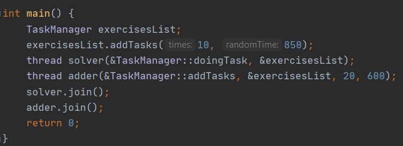
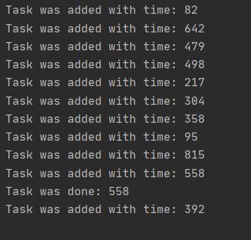
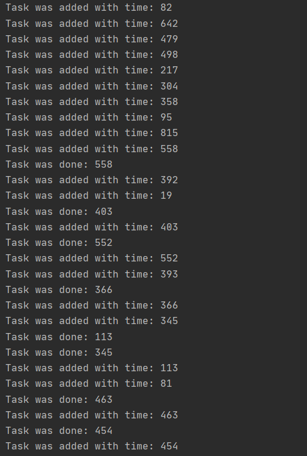
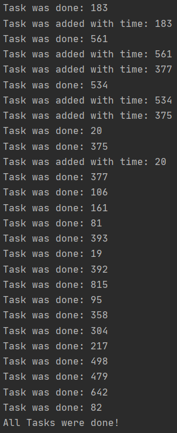

**TASK MANAGER SIMULATOR(LIFO)**

First of all data structure Stack was written, which has all necessary functions as add 
element, read last element and delete last element.
Stack was created on the basis of LinkedList.
Stack take elements type of Task.

This linked list was written with help of structure like Node,
instance of which has two fields like pointer to the previous Node and second field is
instance of structure Task.

**Structure Task**

Task is th structure which has one field namely time. It means that every task need same time
for solving. 

**Task Manager**

Then we can observe Task Manager which has field Stack and three function,
like add Task, delete Task and synchronized function for out.

**Simulation of Task Manager with help of THREADS**

First of all we create some Tasks and add them to our stack,
after successful adding we create two Thread in main function.

First Thread take instance of Task Manager and function addTasks from this class
as parameters, and then this thread will add new Tasks to already existed Stack,
with random delay between adding.
After adding task to the stack, it write message about successful adding of Task.
Message include also time, which need Task to be solved. 

Second one Thread take instance of Task Manager and function deleteTasks from this class
as parameters. This thread will delete tasks from Stack. After calling delete function from 
stack, thread get the last task, which also include information, how long this thread has to
sleep. Also after task's deleting our thread write message that task was done with some needed 
fot it Time.

Function for writing messages was created separate, because it was an attempt
to synchronize work of our threads.

Main Thread waits until to other threads finished their work.

**Examples**
In main we create first amount of Tasks, and then create two threads for adding and solving our tasks.

Main function

First Part of task were added.

Parallel work of two threads for adding and solving tasks.

Finishing work of first thread for adding tasks and last part of work second thread
with solving ad deleting tasks from stack.

